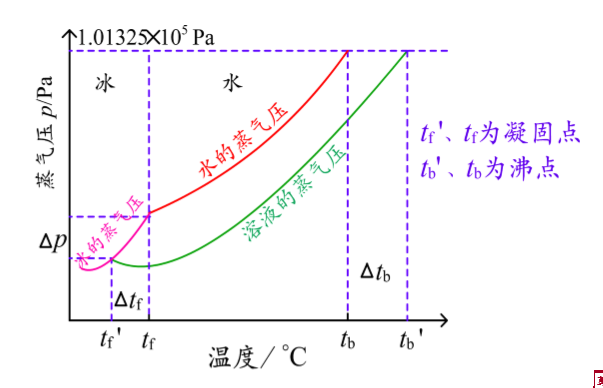
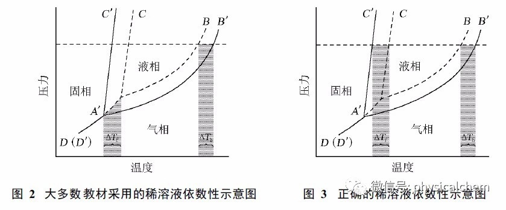

# 3.1.1 非电解质稀溶液的通性

## 依数性的定义

与纯溶剂比较，**难挥发** 的 **非电解质** **稀** 溶液 中溶剂的 **蒸气压下降**、**沸点升高**、**凝固点降低** 和 **渗透压的数值升高**，只与溶液中溶质的量有关，**与溶质的本性无关**，故称这些性质为稀溶液的 **依数性**。

> 依数性是针对溶液来谈的，主要为蒸气压下降、沸点上升和凝固点下降和渗透压改变的性质，和液体本身无关的性质。（摘抄自维基百科，引用自 W.J. Moore Physical Chemistry Prentice-Hall 1972）

## 依数性的内容

- 蒸气压下降
- 沸点上升和凝固点下降
- 渗透压上升

#### 溶液的蒸气压下降

蒸气压指的是在液体（或者固体）表面存在着该物质的蒸汽，这些蒸汽对液体表面产生的压强就是该液体的蒸气压。

> 当溶液温度降低，溶质不断析出，溶液性质不断接近纯溶剂的性质，直到溶质全部析出导致

> 图注：标准凝固点是指标准态压力下液态与固态处于平衡的温度。凝固点的降低，应该是压力在同一水平线上的两个点对应的温度差（即，相同压力水平线分别和AC 和A'C'的交点的温度差值），而不是两个三相点对应的温度差。（高胜利,陈三平,谢钢,杨奇.关于稀溶液依数性讲解中的几个问题讨论[J].大学化学,2010,25(05):66-69.）

蒸气压下降的原因有：

- 溶质占据液体表面阻止空气与溶剂接触从而抑制蒸发
- **难挥发性** 的溶质会吸引溶剂

----

在一定温度下，难挥发的非电解质稀溶液的蒸气压满足：

$$
p_A = x_A\cdot{p_A}^*
$$

- **$p_A$** 稀溶液的蒸气压
- **${p_A}^*$** 纯溶剂的蒸气压
- **$x_A$** 溶剂的摩尔分数

-----

**拉乌尔定律**

在一定温度下，难挥发的非电解质溶液的蒸气压下降 $\Delta p$ 与溶质的摩尔分数成正比，**与溶质的本性无关**。

$$
{p_A}^\* - p_A = \Delta p = x_B\cdot{p_A}^\*
$$

- **${p_A}^*$** 是纯溶剂的蒸气压
- **$x_B$** 是溶质 B 在溶液中的摩尔分数、

由于是 **稀溶液** 中，溶液物质的量 $n_A + n_B$ 中溶质的物质的量 $n_B$ 很小可以忽略，进而可以 $n_A + n_B \approx n_A$。推导可得：

$$
\Delta P = {p_A}^\* \cdot x_B = {p_A}^\* \cdot \frac{n_B}{n_A + n_B} \\\\
\approx {p_A}^\* \cdot \frac{n_B}{n_A} = {p_A}^\* \cdot \frac{n_B}{\frac{w_A}{M_A}} \\\\
= ({p_A}^* \cdot M_A) \cdot \frac{n_B}{w_A} = k \cdot m_B
$$

其中 $({p_A}^* \cdot M_A)$ 是该溶剂的常量、由溶剂种类决定，在这里用 k 表示

#### 测量依数性的用途

通过测量稀的非离子水溶液中的依数性，可以求得溶质的相对分子质量的精确值。反之如果已知溶质相对分子质量，可检测其浓度。

