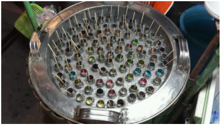

# 3.1.2 电解质溶液的通性

与难挥发的非电解质稀溶液比较，**难挥发** 的 **电解质** **稀** 溶液 和一些 **浓度较大的非电解质溶液** 中溶剂也满足 **蒸气压下降**、**沸点升高**、**凝固点降低** 和 **渗透压的数值升高**，但 **不符合依数性**

## 解离度

### 定义

解离度是电解质达到解离平衡时已解离的分子数和原有分子数的比值，反映了电解质的解离程度。

$$
\alpha = \frac{解离的分子数}{原有的分子数}
$$

> 一般讲质量摩尔浓度为 0.1mol/kg 的电解质在溶液中解离度大于 30% 的称为强电解质，解离度小于 5% 的称为弱电解质，而解离度介于 5% ~ 30% 的称为中强度电解质。

### 解离度与范特霍夫系数之间的关系

虽然电解质溶液的性质不符合依数性，但是在给依数性公式引入校正系数 $i$ 后仍然可以用于电解质溶液。这个校正系数被称为范特霍夫系数，和解离度之间满足：

$$
i = 1 + \alpha
$$

?> 推导过程以 硼酸 的电离为例

$$
HB + H\_{2}O \Leftarrow\Rightarrow H\_{3}O + B^{-}
$$

|  | HB | $H_2O$ | $B^-$ |
|:---:|:---:|:---:|:---:|
| 初始浓度 | c | 0 | 0 |
| 平衡浓度 | $ c - c \cdot\alpha$ | $c \cdot\alpha$ | $c \cdot\alpha$ |

## 电解质的依数性

粒子数总和 = $c \cdot \alpha + c$ 
校正系数 = $i = \cfrac{c \cdot \alpha + c}{c} = 1 + \alpha$

借助校正系数，电解质的「依数性」可以表示为

$$
\Delta P = i \cdot p_A^* \cdot x_B \\\\
\Delta T = i \cdot k \cdot m_B \\\\
\pi = i \cdot cRT
$$

对于不同种类的电解质，存在以下关系：

$$
i(A_2B、AB_2\,强电解质) > i(AB\,强电解质) > i(AB\,弱电解质) > i(非电解质)
$$

> 其中 i(非电解质) 为单位「1」

## 电解质性质之间的关系

粒子数与沸点渗透压呈正相关；与蒸气压和凝固点呈负相关。

> 用途：
> **干燥剂 - 蒸气压下降** $CaO$、$CaCl_2$、$NaOH$、$P_2O_5$ 等离子固体易潮解，吸收空气中的水蒸气变成溶液，该溶液的蒸气压相对于水蒸气的分压小，使空气中的水蒸气不断被溶液吸收，达到干燥的目的。
>
> **马路撒盐抗结冰 - 凝固点降低** $CaCl_2$ 与冰或者雪混合形成盐溶液，使凝固点降低
>
> **土法冰块加盐制冰棍 - 凝固点降低** 同理，往冰块中加盐使凝固点下降，冰块便溶解、吸收大量的热使温度下降

